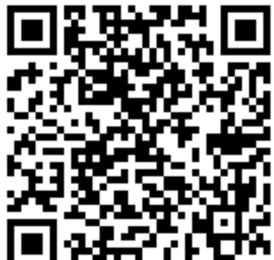

ASKME Animal Bot: A Animal Classification Chatbot using Tensorflow inception model
==============

   

## Features:

- Upload an animal photo, this chatbot will tell you what animal it is.
- All the training model using [Tensorflow Inception](https://github.com/tensorflow/models/tree/master/inception) result.

How to use it
---------------

### Add friend:

- Upload photo 
- See result

How to build your own Tensorflow Chatbot in Golang
---------------

TBC

License
---------------

Licensed under the Apache License, Version 2.0 (the "License");
you may not use this file except in compliance with the License.
You may obtain a copy of the License at

http://www.apache.org/licenses/LICENSE-2.0

Unless required by applicable law or agreed to in writing, software
distributed under the License is distributed on an "AS IS" BASIS,
WITHOUT WARRANTIES OR CONDITIONS OF ANY KIND, either express or implied.
See the License for the specific language governing permissions and
limitations under the License.

